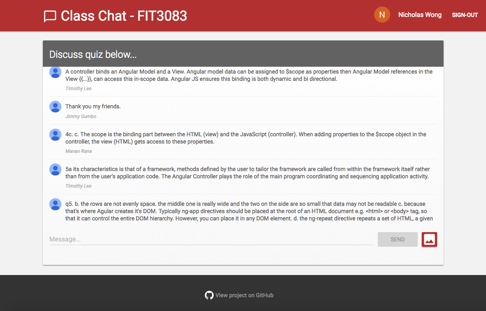

# ClassChat
#### ***A real time web chat app powered by Firebase***

## Usage
The app is live and can be found [here](https://njwong.github.io/ClassChat/).

To leave comments and upload pictures, sign in using your Google account. Authentication is provided by Google and is built in to Firebase.

## Showcase

## Overview
The original motivation for this application was to experiment with Firebase and see what this service has to offer. I followed the Codelab tutorial [*Firebase: Build a Real Time Web Chat App Codelab*](https://codelabs.developers.google.com/codelabs/firebase-web/) which can be completed in about 1 hour. Although customised to suit my own needs, much of the code used in this project can be found here: [*Friendly Chat*](https://github.com/firebase/friendlychat).

This application uses [*Material Design Lite*](https://getmdl.io/index.html) for the UI with some minor customisations to suit my needs. By design it is responsive and works well on mobile devices (from my limited testing).

Finally, this application is hosted using [*GitHub Pages*](https://pages.github.com/).

### Using this app in University
For one of my University units we are required to participate in an online quiz during every lecture. The questions require short to medium answers and aim to test everyone's understanding of the material. Thus, there is a heavy emphasis on group discussion. The class is quite large and it can become quite loud during this time, so it's really only possible to talk with people very close to you.

I was curious to see how class discussion could be facilitated using an online real time chat, so that is another reason why I modified and deployed this application. My peers would want a short and easy sign in process otherwise no one would be bothered to use it. All Monash students have a Google student account, so using Google's authentication service was a logical choice.

The idea is to just share the link with your class mates, sign in using your student Google account, and then you can contribute to the discussion. Quick, easy, seamless.

